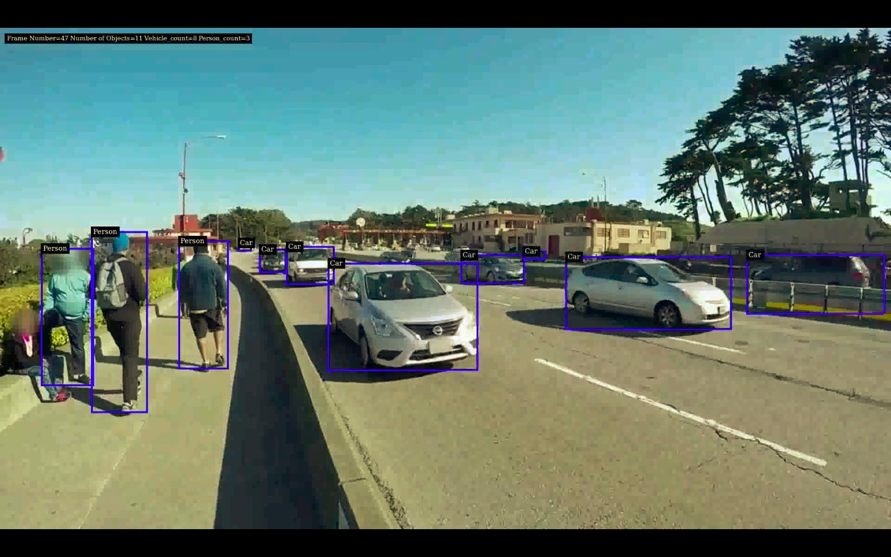
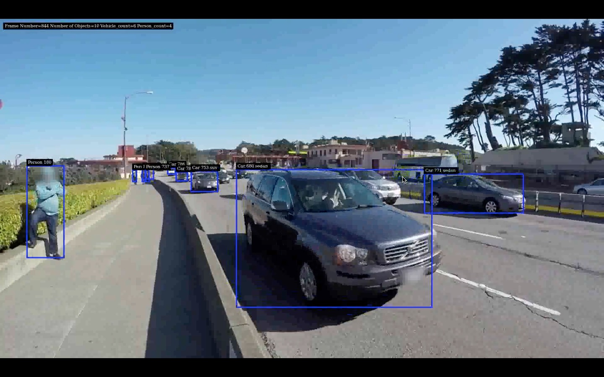

# Integrating TAO Models in a DeepStream Pipeline

This repository contains notebooks and companion code in one single place. The notebooks offer an insight into integrating TAO Pretrained models (available from [NGC Catalog](https://catalog.ngc.nvidia.com)) into DeepStream pipeline to accelerate video inferencing.

SDK versions supported: 5.0+  
SDK version tested: 5.0-20.07-triton

This repository was tested on an NVIDIA T4 GPU, and recommends that the TAO Pre-trained models be downloaded separately into the [models](models/) folder.

## The Notebooks

There are two Jupyter Notebooks on this repository, titled `TAO_Integration_pgie` and `TAO_Integration_sgie` respectively.

[TAO_Integration_pgie](notebooks/TAO_Integration_pgie.ipynb): This notebook explains and walks through the steps to create a simple 4-class object detection pipeline using TrafficCamNet as the primary inference engine.

[TAO_Integration_sgie](notebooks/TAO_Integration_sgie.ipnb): This notebook explains and walk through the steps to create a 4-class object detection and classification pipeline, using TrafficCamNet as the primary inference engine and VehicleTypeNet as the secondary inference engine.

Both the notebooks also contain necessary explanations within themselves.

## Containers

A Dockerfile is also included in this repository for quick setup of a Docker container to work with.
To run the Dockerfile, run `docker build - < Dockerfile -t ds_tao_integration:latest` on your command line.

**Note**: The docker file assumes you have the DeepStream 5.0-20.07-triton container already installed on your system.
